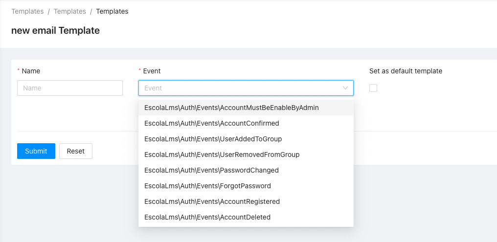

# Templates-PDF

Package for generating PDFs from configurable Templates.

## Purpose

This package allows you to create PDFs generated after a specific Event is emitted in Laravel / LMS app.

Each PDF Template has a corresponding class describing available variables that can be used in the Template (which will be stored in database and editable through admin panel).
Templates are saved as serialized fabric.js canvas containing these variables which will be replaced during PDF generation with correct data extracted from Event.

Class describing Template Variables must be registered using Template facade from `EscolaLms\Template` package, where you specify which Event it is associated with it and which Channel it is sent through (e.g. `EscolaLms\TemplatesPdf\Core\PdfChannel` which is defined in this package).

## Installing

- `composer require escolalms/templates-pdf`
- `php artisan db:migrate`
- `php artisan db:seed --class="EscolaLms\TemplatesPdf\Database\Seeders\TemplatesPdfSeeder"` to create default templates for all Variable/Event pairs registered for PDF channel

## Dependencies

- `EscolaLms\Templates` core Templates package
- optional: `EscolaLms\Courses` for generating PDFs related to Courses

## Usage

### Defining Templates

1. Create Event which triggers generation of PDF using specified template. This event must implement method `getUser()` returning User model from LMS Core package.
2. Create class defining template Variables, which you will use in PDF template,
3. Associate your class describing template Variables with correct Event and Channel. Use `EscolaLms\Templates\Facades\Template::register(Event class, EscolaLms\TemplatesPdf\Core\PdfChannel::class, Variable class);` method.
4. Use admin panel or `/api/admin/templates` web API to create/edit templates associated with this Variable/Event/Channel set. See [Template package](https://github.com/EscolaLMS/Templates) for more information.

## Tests

Run `./vendor/bin/phpunit --filter 'EscolaLms\\TemplatesPdf\\Tests'` to run tests. See [tests](tests) folder as it contains a basic implementation of Variables class (description of what Template can/must contain) with minimal customisation - a quite good starting point for creating your own.

Test details:

## Usage on front end

### Admin panel

#### **Left menu**

#### **List of templates**

#### **Creating/editing template**

## Permissions

Permissions are defined in [Enum](src/Enums/PdfPermissionsEnum.php) and seeded in [Seeder](database/seeders/PermissionTableSeeder.php).

## Roadmap. Todo. Troubleshooting

- ???
